# React Component Library gov-ua-ui. Buttons

## [Components List](COMPONENTS_LIST.md)

## New component template

## [COMPONENT_NAME]

### [Component props]

- **prop1**: string - some string value
- **prop2**: boolean - some boolean value
- **prop3**: (e: ChangeEvent<HTMLInputElement>) => void - some change event handler

### [Component examples]

```js
import { Component } from "gov-ua-ui";

const handelChangeEvent = (e: ChangeEvent<HTMLInputElement>) => {
...
}

<Component
  prop1="es"
  prop2={false}
  prop3={handelChangeEvent}
/>
```

## Buttons:

- [CommonButton](#CommonButton)
- [AnswerButton](#AnswerButton)
- [RadioButton](#RadioButton)
- [SwitchButton](#SwitchButton)

### CommonButton
<a name="CommonButton"></a>

#### props
- **label?**: string;
- **outlined?**: boolean;
- **disabled?**: boolean;
- **dashed?**: boolean;
- **className?**: string;
- **large?**: boolean;
- **image?**: string; - button image.
- **round?**: boolean; - is button round if true, the label will not be displayed, but image if exists will be
  displayed.
- **onClick?**: (e: React.MouseEvent<HTMLButtonElement, MouseEvent>) => void;

#### Examples
```tsx
import CommonButton from "components/buttons/CommonButton";
import PlusIcon from "assets/images/ui-icons/plus.svg";

const handleButtonClick = (e: React.MouseEvent<HTMLButtonElement, MouseEvent>) => {
...
}

return (
  <div>
    {/*Default button*/}
    <CommonButton
      label="Send"
      onClick={handleButtonClick}
    />
    {/*Disabled button*/}
    <CommonButton
      label="Send"
      disabled={true}
      onClick={handleButtonClick}
    />
    {/*Default button with image*/}
    <CommonButton
      label="Click me"
      image={PlusIcon}
      onClick={handleButtonClick}
    />
    {/*Round button without image*/}
    <CommonButton
      round={true}
      onClick={handleButtonClick}
    />
    {/*Round button outlined with image*/}
    <CommonButton
      round={true}
      outlined={true}
      image={PlusIcon}
      onClick={handleButtonClick}
    />
  </div>
);
```
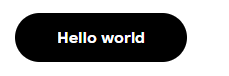
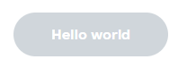
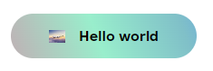
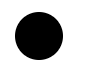


### AnswerButton
<a name="AnswerButton"></a>

#### props
- **label?**: string;
- **cancel?**: boolean;
- **className?**: string;
- **round?**: boolean; - is button round, if true, the label will not be displayed.
- **hold?**: boolean; - set button appearance as answered.
- **onClick?**: (e: React.MouseEvent<HTMLButtonElement, MouseEvent>) => void;

#### Examples
```tsx
import AnswerButton from "components/buttons/AnswerButton";

const handleButtonClick = (e: React.MouseEvent<HTMLButtonElement, MouseEvent>) => {
...
}

return (
        <div>
          {/*AnswerButton default*/}
          <AnswerButton
                  label="Send"
                  onClick={handleButtonClick}
          />
          {/*AnswerButton holded*/}
          <AnswerButton
                  label="Send"
                  hold={true}
                  onClick={handleButtonClick}
          />
          {/*AnswerButton round*/}
          <AnswerButton
                  round={true}
                  onClick={handleButtonClick}
          />
          {/*AnswerButton round holded*/}
          <AnswerButton
                  round={true}
                  hold={true}
                  onClick={handleButtonClick}
          />
        </div>
);
```
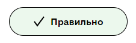
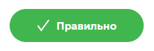
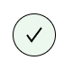


### RadioButton
<a name="RadioButton"></a>

#### props
- **title?**: string; - top text
- **body?**: string; - middle text
- **footer?**: string; - bottom text
- **warning?**: string; - error text
- **name**: string;
- **value**: any;
- **checked**: boolean;
- **disabled?**: boolean;
- **className?**: string;
- **onClick**: (e: React.MouseEvent<HTMLLabelElement, MouseEvent>) => void;

#### Examples
```tsx
import RadioButton from "components/buttons/RadioButton";

const handleButtonClick = (e: React.MouseEvent<HTMLLabelElement, MouseEvent>) => {
...
}

return (
  <div>
    {/*RadioButton default*/}
    <RadioButton
      name="primary"
      value="primary"
      checked={true}
    />
    {/*RadioButton with texts*/}
    <RadioButton
            name="primary"
            value="primary"
            checked={true}
            title="Test title"
            body="Test body"
            footer="Test footer"
    />
    {/*RadioButton with error*/}
    <RadioButton
            name="primary"
            value="primary"
            checked={true}
            title="Test title"
            body="Test body"
            footer="Test footer"
            warning="Test warning"
    />
  </div>
);
```
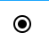

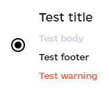

### SwitchButton
<a name="SwitchButton"></a>

#### props
- **active?**: boolean;
- **onChange?**: (e: React.MouseEvent<HTMLInputElement, MouseEvent>) => void;
- **className?**: string; 

#### Examples
```tsx
import SwitchButton from "components/buttons/SwitchButton";

const handleButtonClick = (e: React.MouseEvent<HTMLInputElement, MouseEvent>) => {
...
}

return (
  <div>
    <SwitchButton
      onChange={handleButtonClick}
    />
  </div>
);
```
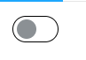
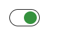

