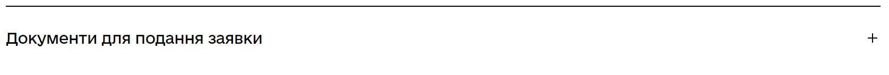
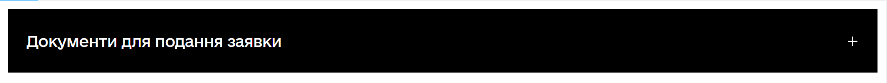
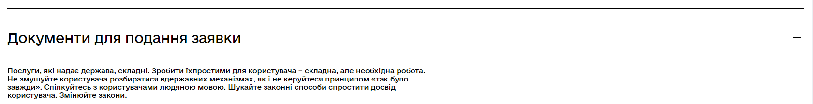

# React Component Library gov-ua-ui. Expands

## [Components List](COMPONENTS_LIST.md)

## New component template

## [COMPONENT_NAME]

### [Component props]

- **prop1**: string - some string value
- **prop2**: boolean - some boolean value
- **prop3**: (e: ChangeEvent<HTMLInputElement>) => void - some change event handler

### [Component examples]

```js
import { Component } from "gov-ua-ui";

const handelChangeEvent = (e: ChangeEvent<HTMLInputElement>) => {
...
}

<Component
  prop1="es"
  prop2={false}
  prop3={handelChangeEvent}
/>
```

## Expands:

- [Expand](#Expand)

### Expand

<a name="Expand"></a>

#### props

- **title**: string;
- **children?**: any;
- **open?**: boolean;
- **isLast?**: boolean; - uses for list of expands, removes bottom border.

#### Examples

```tsx
import Expand from "components/Expand";

return (
  <div>
    <Expand
      title="Документи для подання заявки"
      children="Послуги, які надає держава, складні. Зробити їхпростими для користувача – складна, але необхідна робота. Не змушуйте користувача розбиратися вдержавних механізмах, як і не керуйтеся принципом «так було завжди». Спілкуйтесь з користувачами людяною мовою. Шукайте законні способи спростити досвід користувача. Змінюйте закони."
    />

    {/* OR */}

    <Expand
      title="Документи для подання заявки"
    >
      Послуги, які надає держава, складні. Зробити їхпростими для користувача – складна, але необхідна робота. Не
      змушуйте користувача розбиратися вдержавних механізмах, як і не керуйтеся принципом «так було завжди». Спілкуйтесь
      з користувачами людяною мовою. Шукайте законні способи спростити досвід користувача. Змінюйте закони.
    </Expand>
  </div>
);
```



