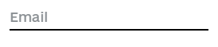
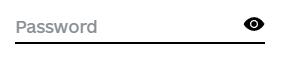

# React Component Library gov-ua-ui. Inputs

## [Components List](COMPONENTS_LIST.md)

## New component template

## [COMPONENT_NAME]

### [Component props]

- **prop1**: string - some string value
- **prop2**: boolean - some boolean value
- **prop3**: (e: ChangeEvent<HTMLInputElement>) => void - some change event handler

### [Component examples]

```tsx
import { Component } from "gov-ua-ui";

const handelChangeEvent = (e: ChangeEvent<HTMLInputElement>) => {
...
}

<Component
  prop1="es"
  prop2={false}
  prop3={handelChangeEvent}
/>
```

## Inputs:

- [FormField](#FormField)
- [Select](#Select)

### FormField

<a name="FormField"></a>

#### props

- **name**: string.
- **placeholder**: string.
- **type**: React.HTMLInputTypeAttribute - default "text".
- **className**: string.
- **errors**: FormikErrors<{email: string}> - validation errors from Formik form.
- **touched**:  FormikTouched<{email: string}> - touched indicator from Formik form.
- **onBlur**: (e: FocusEvent<HTMLInputElement>) => void - onBlur event handler.
- **noBorders**: boolean - show or not bottom border.
- **errComponent**: React.ComponentType - component for error
- **errClassName**: string.

#### Examples

```tsx
import { Form, Formik } from "formik";
import * as Yup from "yup";

import FormField from "src/components/inputs/FormField";

const onFormSubmit = (values: { email: string, password: string }) => {
  const fields = {
    email: values.email || null,
    password: values.password || null
  };
};

const ValidationSchema = Yup.object().shape({
  email: Yup.string().email("Invalid email").required("Required"),
  password: Yup.string().password("Invalid password").required("Required")
});

return (
  <Formik
    initialValues={{ email: "", password: "" }}
    onSubmit={(values, actions) => {
      onFormSubmit(values);
    }}
    validationSchema={ValidationSchema}
    enableReinitialize={true}
    validateOnChange={true}
  >
    {({ errors, touched }) => (
      <Form>
        {/*Default input*/}
        <FormField
          type="email"
          name="email"
          placeholder="Email"
          errors={errors}
          touched={touched}
        />
        {/*Input without borders*/}
        <FormField
          type="email"
          name="email"
          placeholder="Email"
          errors={errors}
          touched={touched}
          noBorders={true}
        />
        {/*Password input*/}
        <FormField
          type="password"
          name="password"
          placeholder="Password"
          errors={errors}
          touched={touched}
        />
        <button type="submit">submit</button>
      </Form>
    )}
  </Formik>
);
```





Without validation

```tsx
import { Form, Formik } from "formik";
import * as Yup from "yup";

import FormField from "src/components/inputs/FormField";

const onFormSubmit = (values: { email: string }) => {
  const fields = {
    email: values.email || null,
  };
};

return (
  <Formik
    initialValues={{ email: "", password: "" }}
    onSubmit={(values, actions) => {
      onFormSubmit(values);
    }}
    enableReinitialize={true}
  >
    {({ errors, touched }) => (
      <Form>
        {/*Default input*/}
        <FormField
          type="email"
          name="email"
          placeholder="Email"
        />
      </Form>
    )}
  </Formik>
);
```

### Select

<a name="Select"></a>

#### props

- **onChange?**: (value: any) => void;
- **onBlur?**: () => void;
- **options?**: Array<{ value?: string | number; label?: string | number; }>;
- **placeholder?**: string;
- **className?**: string;
- **name?**: string;
- **styles?**: object;

#### Examples

```tsx
import Select from "src/components/inputs/Select";

const mockData = [
  { value: "cfr", label: "CFR" },
  { value: "frc", label: "FRC" },
  { value: "rcf", label: "RCF" }
];

const handleSelectChange = (value: string) => {
  ...
}

return (
  <Select
    options={standardMock}
    placeholder="Chose"
    name="chose"
    onChange={handleSelectChange}
  />
);
```
