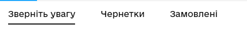
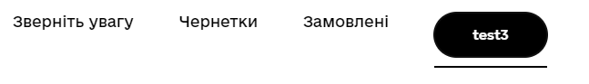

# React Component Library gov-ua-ui. Navigations

## [Components List](COMPONENTS_LIST.md)

## New component template

## [COMPONENT_NAME]

### [Component props]

- **prop1**: string - some string value
- **prop2**: boolean - some boolean value
- **prop3**: (e: ChangeEvent<HTMLInputElement>) => void - some change event handler

### [Component examples]

```js
import { Component } from "gov-ua-ui";

const handelChangeEvent = (e: ChangeEvent<HTMLInputElement>) => {
...
}

<Component
  prop1="es"
  prop2={false}
  prop3={handelChangeEvent}
/>
```

## Navigations:

- [Navigation](#Navigation)

### Navigation

<a name="Navigation"></a>

#### props

- **navLinks**: [LinkInterface]; - array of navigation links.
- **className**: string;

LinkInterface

- **to**: string;
- **text**: string;
- **customContent?**: any; - you can pass React components, as content for the link, so text will not be displayed
- **customStyles?**: string; - additional styles for the link

#### Examples

```tsx
import Navigation from "../Navigation";

const navigationLinks = [
  {
    text: "Загальна інформація",
    to: "/"
  },
  {
    text: "Підстава видачі сертифіката",
    to: "/basics"
  },
  {
    text: "Документи",
    to: "/docs"
  },
  {
    text: "",
    to: "/some-btn",
    customContent: (
      <CommonButton label="Some button in navigation" />
    ),
    customStyles: "some styles"
  },
];

return (
  <Navigation navLinks={navLinks}
              title="Test Navigation"
  />
);
```


