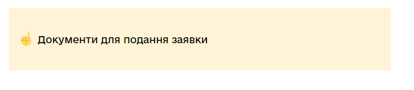
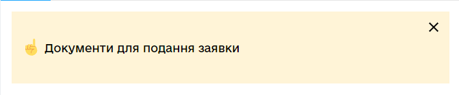

# React Component Library gov-ua-ui. Notifications

## [Components List](COMPONENTS_LIST.md)

## New component template

## [COMPONENT_NAME]

### [Component props]

- **prop1**: string - some string value
- **prop2**: boolean - some boolean value
- **prop3**: (e: ChangeEvent<HTMLInputElement>) => void - some change event handler

### [Component examples]

```js
import { Component } from "gov-ua-ui";

const handelChangeEvent = (e: ChangeEvent<HTMLInputElement>) => {
...
}

<Component
  prop1="es"
  prop2={false}
  prop3={handelChangeEvent}
/>
```

## Notifications:

- [Navigation](#Notification)

### Notification

<a name="Notification"></a>

#### props

- **text**: string;
- **className?**: string;
- **withButton?**: boolean; - adding cross button to right upper corner of notification.

#### Examples

```tsx
import Notification from "components/Notification";

return (
  <>
    <Notification text="Test Notification" />

    {/*Notification with button*/}
    <Notification text="Test Notification" withButton={true}/>
  </>
);
```


